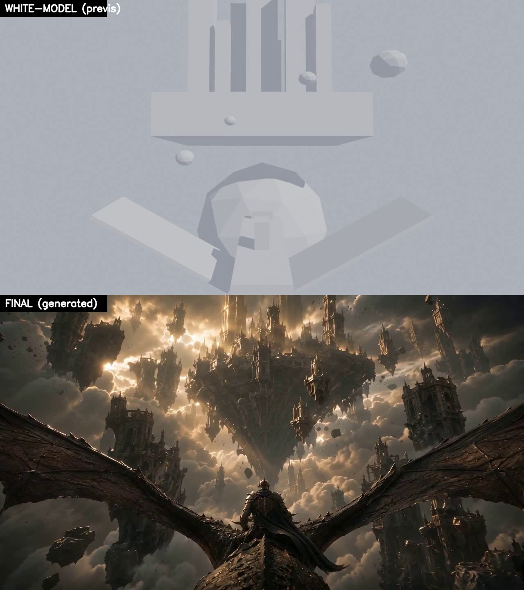
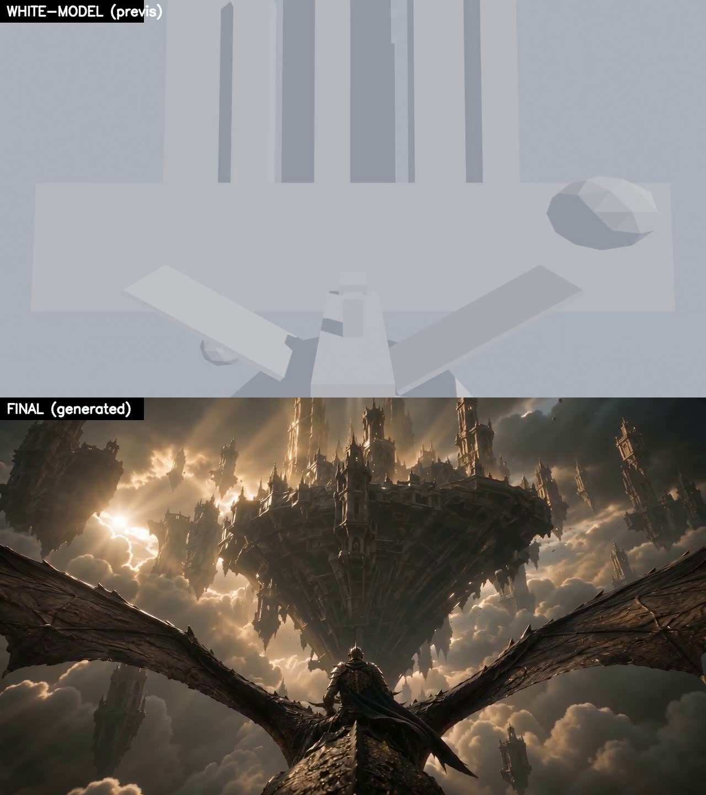

# blender-shot-video

[English](README.md) | **中文**

把一句话创意,变成一个**相机真正可控**的史诗短视频镜头——用 Blender 的灰模
**白膜**锁定运镜和构图,再让任意 AI 视频模型,根据"首帧图 + 这段白膜"把成片画出来。

> **为什么有这东西。** 纯文生视频对相机没有真正的控制;而拿**带贴图**的 previs 去做
> 参考生视频,墙会"像一张贴图",还会出артефакты(比如脖子突然扭 180°)。解法:用
> **纯灰模 blockout** 驱动模型(它读的是体积/深度,不是一张平面图)+ 一张强首帧定外观。
> 白膜随便改、免费迭代,只有运镜满意了才花钱出片。

## 示例:白膜 → 成片

同一个镜头,上面是白膜 previs,下面是生成结果——机位、构图、主体位置完全一致。
灰盒子变成了真实的埃尔登风天空之城;龙与骑手全程稳居画面。




*(上 = `build_whitemodel.py` 的白膜。下 = 由它 + 首帧图生成的 AI 视频。用
`compare_stack.py` 拼接。)*

## 流程

```
一句话创意
  ① 拆镜    (免费)   → 三段式脚本:基础设定 / 氛围与画质 / 画面内容(分镜)
  ② 定调    (问用户) → 确认风格 + 运镜 + 布局
  ③ 首帧    (付费*)  → 1 张定场图(任意文生图,或用户自带)
  ④ 白膜    (免费)   → Blender 灰模 previs,带规划好的运镜
  ⑤ 出片    (付费)   → 成片 = 首帧图 + 白膜 previs + 提示词
  ⑥ 对比    (免费)   → 白膜/成片上下拼接,便于审阅
```
`*` 用户自带首帧时,③ 免费。

**核心思路:** ④ 在 ⑤ 给模型三样东西——**首帧**(外观锚点)、**白膜 previs**
(相机 + 运动 + 空间引导)、**导演镜头版提示词**。白膜是纯灰几何,这是刻意的。

## 快速上手

在 Claude Code 里:`/blender-shot-video` + 一句话(例:*"骑士骑龙冲向一座巨大的破碎
天空之城"*)。Agent 会走完整条流程,在人工闸口(② 风格、④ 白膜审阅)和每次付费调用前停下来。

手动调用脚本:
```bash
# ④ 从 shot spec 渲白膜 previs(参考 references/shot-spec.example.json)
blender -b -P scripts/build_whitemodel.py -- --shot-spec shot.json --output previs.mp4

# ③ 首帧(Ark 适配器;或自带图跳过这步)
python scripts/gen_firstframe.py --prompt "<firstFramePrompt>" --out ff.jpg

# ⑤ 成片(Ark 适配器)
python scripts/generate_video.py --first-frame ff.jpg --previs previs.mp4 \
    --prompt "<videoPrompt>" --out final.mp4 --duration 10 --ratio 16:9

# ⑥ 对比(白膜在上、成片在下)
python scripts/compare_stack.py --top previs.mp4 --bottom final.mp4 --out compare.mp4
```

## 模型无关

固定且免费的核心是 ①②④(拆镜 → 白膜)。③/⑤ 的模型调用是**可插拔适配器**——自带了
一份火山 Ark / Seedance 实现作参考;换任意厂商即可,只要遵守同一契约:

| 步 | 契约(输入 → 输出) | 自带适配器 |
|---|---|---|
| ③ | 提示词 → 1 张图 | `scripts/gen_firstframe.py`(`--model`、`$ARK_IMAGE_ENDPOINT`) |
| ⑤ | 首帧图 + 参考视频 + 提示词 → 1 段视频 | `scripts/generate_video.py`(`--model`、`$ARK_VIDEO_ENDPOINT`) |

## 白膜支持的运镜

- **简单** — `start`/`end`/`lookAt`(推进、平移、升降)。
- **多段** — `camera.keyframes`(例:先猛冲、再压低仰摇揭示)。
- **跟随动态主体** — 一个会动的 `subject`(如沿 `path` 飞行的龙)配 `cameraFollow`,
  相机咬在它后面、始终把它框住。
- `easing`:`sine`(在路点缓动)或 `linear`(匀速直冲,不"走走停停")。
- 室内方盒房间(`room`)或开阔天空(省略 `room`);blockout `objects` 可为方块或不规则 `rock`。

## 目录结构

```
SKILL.md                         给 agent 的操作契约
README.md / README.zh-CN.md      本文件
references/
  script-breakdown-template.md   ① 三段式脚本格式
  prompt-template.md             ⑤ 导演镜头版提示词结构(含"代理条款")
  shot-spec.example.json         一份完整 shot spec 示例
scripts/
  build_whitemodel.py            ④ Blender 灰模 previs(相机 + 动态主体)
  gen_firstframe.py              ③ 首帧适配器(Ark 文生图)
  generate_video.py              ⑤ 成片适配器(Ark r2v + cloudflared 托管)
  compare_stack.py               ⑥ 白膜/成片拼成对比视频
  _ark.py                        共享的 key/curl 辅助
examples/                        上面那两张对比静帧
```

## 依赖

- **Blender**(④)——用 `$BLENDER_EXECUTABLE` 或已知路径;内置 `bpy` 渲染。
- **系统 Python**(③/⑤/⑥),外加 **`curl`**(③/⑤)和 **`opencv-python`**(⑥)。
- **cloudflared** 仅自带的 Ark 视频适配器需要(很多视频模型只抓公网 URL、够不到
  `localhost`;⑤ 把两个本地文件临时隧道暴露、用完即关)。不入库——放到 `scripts/bin/`
  或设 `$CLOUDFLARED`。
- **API key**:自带 Ark 适配器需设环境变量 `ARK_API_KEY`;换厂商则改用其鉴权方式。

## 写死的规矩(已固化进 SKILL.md)

- **白膜是代理** —— ⑤ 的提示词必须告诉模型**不要**复制灰模/低多边形/方块外观;每个
  形状只代表主体的位置/朝向。
- **出片付费前,先让用户审阅白膜**(强制闸口)。
- **任何付费调用前,先展示请求、取得明确确认。**
- 运镜要克制;被跟随的主体要绕开(而非穿过)密集几何,以免穿模。
